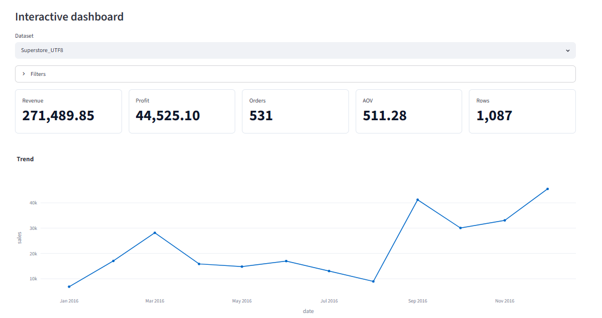
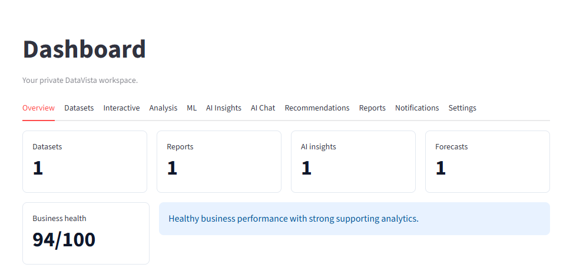
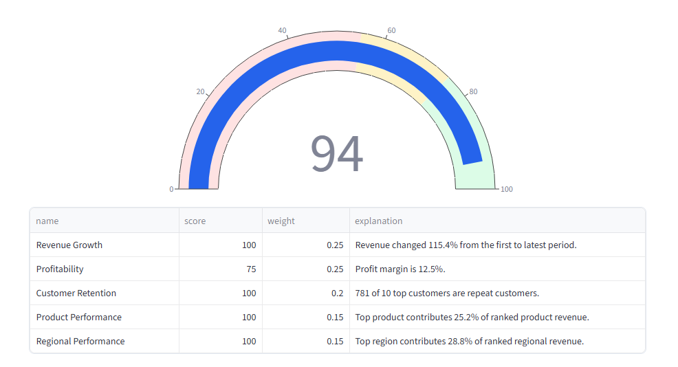
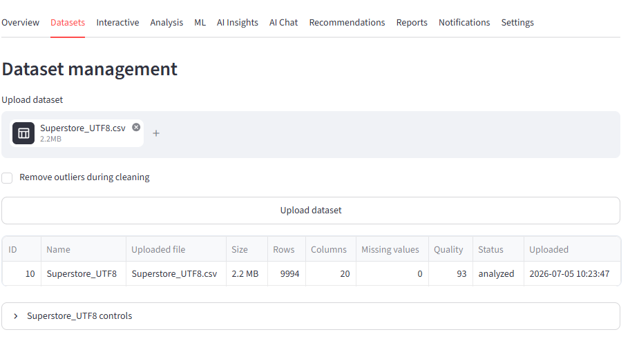
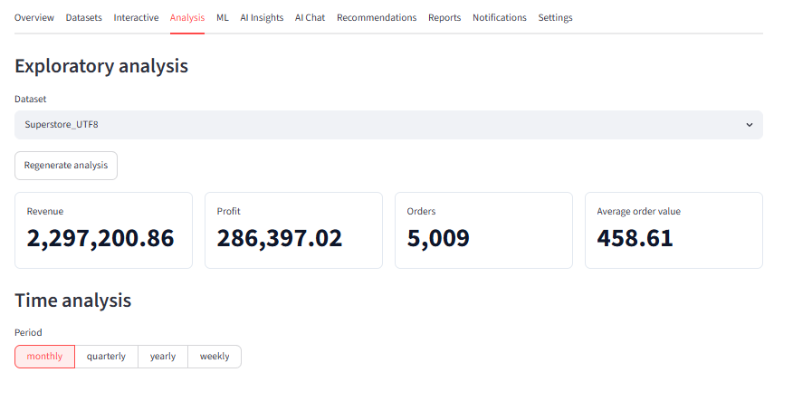
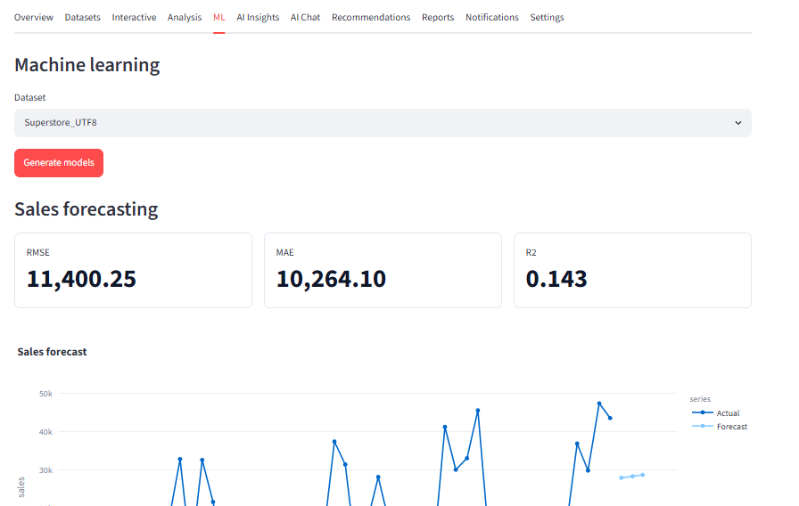
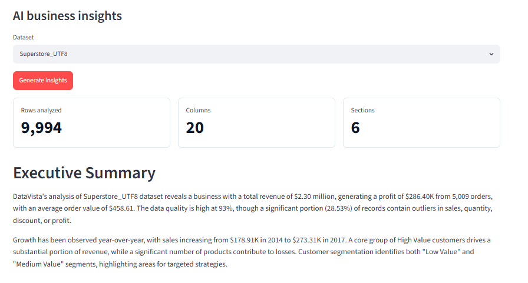
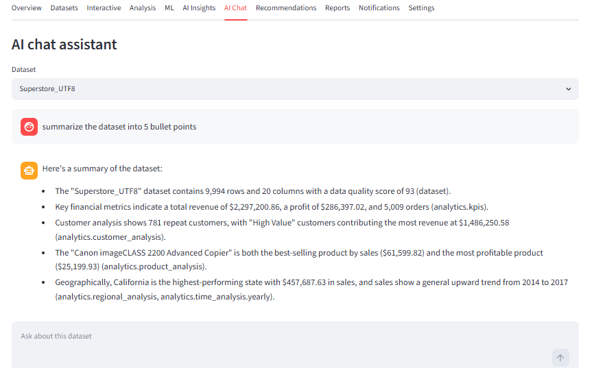
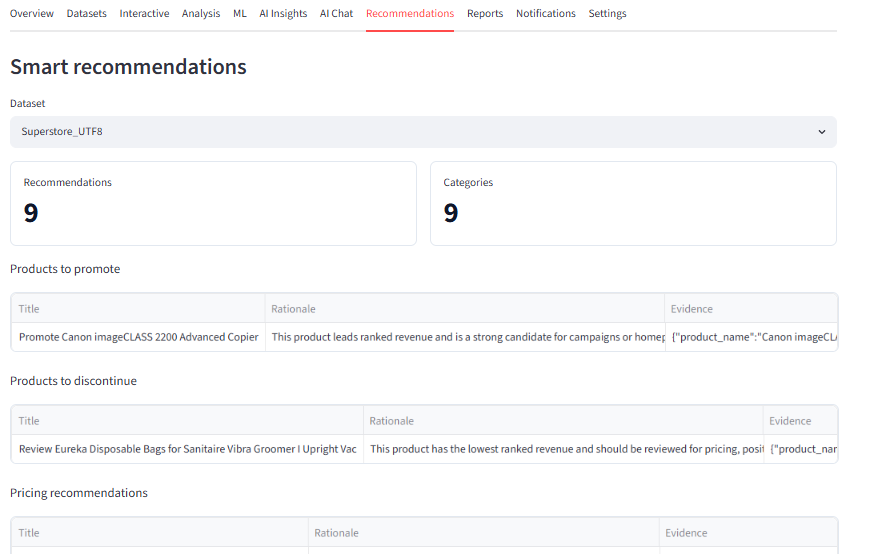
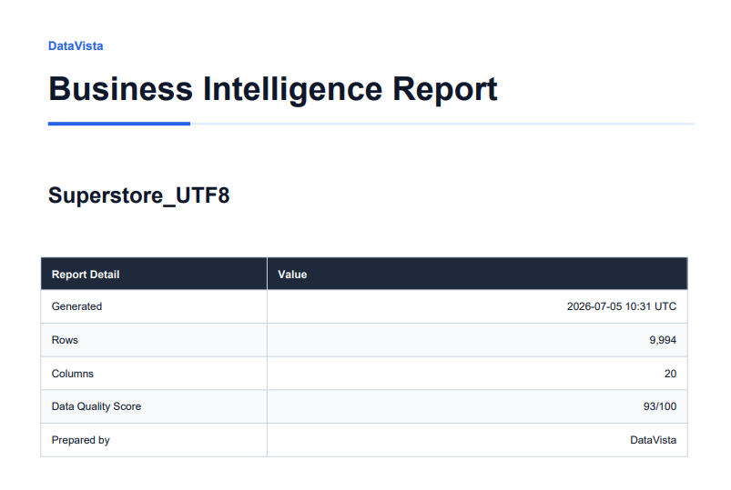

# 📊 DataVista

## AI-Powered Business Analytics & Data Visualization Platform

Transform raw business data into actionable insights using Artificial Intelligence, Machine Learning, Interactive Dashboards, and Google Gemini-powered business intelligence.


---

> 🚀 **Live Demo:** *Coming Soon*

> 📈 **End-to-End Business Analytics | Machine Learning | AI Insights | Interactive Dashboards | Executive Reports**

---



---

# 🚀 Overview

Businesses generate enormous amounts of data every day, but transforming that data into meaningful business insights often requires multiple tools, technical expertise, and significant manual effort.

DataVista simplifies this entire workflow by providing an end-to-end AI-powered business analytics platform where users can upload raw datasets and instantly perform data cleaning, exploratory analysis, interactive visualization, predictive modeling, and AI-assisted business intelligence—all from a single application.

The platform combines modern data science techniques with Large Language Models (Google Gemini) to help users understand business performance, identify growth opportunities, forecast future trends, and generate executive-ready reports without writing analytical code.

Whether you're a data analyst, business analyst, student, researcher, or decision-maker, DataVista enables faster, data-driven decision making through an intuitive and interactive interface.

---

# ✨ Key Features

- 📂 Upload and analyze CSV or Excel datasets
- 🧹 Automatic data cleaning and preprocessing
- 📊 Interactive dashboards with dynamic business KPIs
- 📈 Exploratory Data Analysis (EDA)
- 🤖 Machine Learning forecasting
- 🧠 AI-generated business insights powered by Google Gemini
- 💬 Natural language AI Chat for dataset exploration
- 💡 AI-powered business recommendations
- 📄 Executive-ready PDF report generation
- 🔔 Notification management
- 🔐 Secure JWT Authentication
- 🐳 Docker support
- ✅ Comprehensive automated test suite

---

# 📈 Analytical Capabilities

DataVista provides an end-to-end analytics pipeline designed to transform raw business data into actionable insights.

### Data Processing

- Automatic missing value handling
- Duplicate detection and removal
- Data type validation
- Dataset quality assessment

### Business Analytics

- Business Health Score
- KPI generation
- Revenue analysis
- Profit analysis
- Customer insights
- Regional performance analysis

### Data Visualization

- Interactive dashboards
- Trend analysis
- Dynamic filtering
- Business charts
- KPI cards
- Plotly visualizations

### Machine Learning

- Sales forecasting
- Predictive analytics
- Customer segmentation
- Business trend prediction

### Artificial Intelligence

- Google Gemini integration
- Executive business summaries
- AI-powered recommendations
- Natural language dataset querying
- Context-aware business insights

### Reporting

- Executive PDF reports
- Downloadable cleaned datasets
- AI-generated summaries
- Business recommendations

---

# 📸 Application Walkthrough

DataVista provides a complete end-to-end analytics workflow—from raw dataset upload to AI-powered business intelligence and executive reporting.

Each module has been designed to simplify business analytics while providing meaningful insights through interactive visualizations, machine learning, and Artificial Intelligence.

---

## 🏠 Business Overview

The Overview page gives users a quick snapshot of overall business performance through KPIs and a Business Health Score.

Users can immediately understand how the business is performing without exploring multiple dashboards.

### Highlights

- Business Health Score
- Revenue Growth
- Profitability
- Customer Retention
- Product Performance
- Regional Performance





---

## 📂 Dataset Management

Upload CSV or Excel datasets and automatically prepare them for analytics.

DataVista performs preprocessing, data validation, duplicate detection, missing value handling, and stores datasets for future analysis.

### Features

- CSV Upload
- Excel Upload
- Automatic Cleaning
- Data Quality Checks
- Dataset Management
- Download Cleaned Dataset



---

## 📈 Exploratory Data Analysis

Explore datasets using descriptive statistics and business metrics before moving into predictive analytics.

The analysis page helps users understand trends, distributions, and important KPIs.

### Includes

- Statistical Summary
- Missing Value Analysis
- Correlation Insights
- Business KPIs
- Data Distribution



---

## 📊 Interactive Dashboard

The Interactive Dashboard provides dynamic business intelligence through filters, KPI cards, and interactive charts.

Users can explore business performance across products, customers, sales, and regions.

### Dashboard Features

- Interactive Filters
- KPI Cards
- Revenue Trends
- Category Analysis
- Regional Performance
- Plotly Visualizations


---

## 🤖 Machine Learning

Generate predictive insights using built-in machine learning models.

The forecasting module helps estimate future business performance based on historical data.

### ML Features

- Sales Forecasting
- Predictive Analytics
- Trend Prediction
- Interactive Forecast Charts



---

## 🧠 AI Business Insights

Powered by Google Gemini, DataVista automatically generates executive summaries and business insights from uploaded datasets.

Instead of manually interpreting dashboards, users receive AI-generated explanations and recommendations.

### AI Features

- Executive Summary
- Business Risks
- Growth Opportunities
- Key Findings
- Actionable Insights



---

## 💬 AI Chat Assistant

Interact with your dataset using natural language.

Ask business questions just like chatting with an analyst and receive context-aware answers generated by Google Gemini.

### Examples

- Summarize this dataset.
- Which products are performing best?
- What are the biggest risks?
- Which regions should we focus on?



---

## 💡 Business Recommendations

Receive AI-assisted business recommendations generated from data analysis.

Recommendations help improve profitability, customer retention, sales strategy, and operational efficiency.

### Recommendation Categories

- Revenue Growth
- Customer Retention
- Product Optimization
- Regional Expansion
- Operational Improvements



---

## 📄 Executive Report Generation

Generate executive-ready PDF reports that combine analytics, visualizations, AI insights, and recommendations into a professional business report.

These reports are designed for decision-makers and stakeholders.

### Report Contents

- Executive Summary
- KPI Dashboard
- Business Insights
- Charts & Visualizations
- AI Recommendations
- Downloadable PDF

### Report Management


### Generated Executive Report



---

# 🛠️ Technology Stack

DataVista combines modern backend technologies, machine learning, data visualization, and Artificial Intelligence to deliver an end-to-end business analytics platform.

| Category | Technologies |
|-----------|--------------|
| **Programming Language** | Python 3.12 |
| **Backend Framework** | FastAPI |
| **Frontend Framework** | Streamlit |
| **Database** | SQLite |
| **Machine Learning** | Scikit-learn |
| **Data Processing** | Pandas, NumPy |
| **Visualization** | Plotly, Matplotlib |
| **Artificial Intelligence** | Google Gemini 2.5 Flash |
| **Authentication** | JWT |
| **Report Generation** | ReportLab |
| **Containerization** | Docker, Docker Compose |
| **Testing** | Pytest |

---

# 🏗️ System Architecture

The application follows a modular architecture where every component is responsible for a specific stage of the analytics workflow.

```text
                          CSV / Excel
                               │
                               ▼
                    Dataset Upload Module
                               │
                               ▼
                 Automatic Data Cleaning Engine
                               │
          ┌────────────────────┼────────────────────┐
          ▼                    ▼                    ▼
 Exploratory Data        Interactive        Machine Learning
    Analysis              Dashboard            Forecasting
          │                    │                    │
          └────────────────────┼────────────────────┘
                               ▼
                  Google Gemini AI Integration
                     │            │
                     ▼            ▼
              AI Insights      AI Chat
                     │
                     ▼
          Executive PDF Report Generator
```

---

# 📁 Project Structure

The project follows a modular folder structure that separates backend services, frontend components, analytics, AI, machine learning, and reporting modules.

```text
DataVista
│
├── assets/
│   └── screenshots/
│
├── backend/
│   ├── ai/
│   ├── analytics/
│   ├── auth/
│   ├── dashboard/
│   ├── database/
│   ├── datasets/
│   ├── ml/
│   ├── reports/
│   ├── routes/
│   ├── utils/
│   └── app.py
│
├── frontend/
│   ├── components/
│   ├── assets/
│   ├── styles/
│   ├── utils/
│   └── app.py
│
├── tests/
│
├── uploads/
├── cleaned_data/
├── reports/
├── database/
├── docs/
│
├── Dockerfile
├── docker-compose.yml
├── requirements.txt
└── README.md
```

---

# ⚙️ Core Modules

## 📂 Dataset Module

Responsible for dataset upload, validation, preprocessing, duplicate detection, storage, and retrieval.

---

## 📊 Analytics Module

Provides exploratory data analysis, statistical summaries, business KPIs, health score computation, and recommendation generation.

---

## 🤖 Machine Learning Module

Implements predictive analytics and forecasting using Scikit-learn models.

---

## 🧠 AI Module

Integrates Google Gemini to generate:

- Business Insights
- Executive Summaries
- Dataset Question Answering
- Business Recommendations

---

## 📄 Reports Module

Creates executive-ready PDF reports containing:

- Business KPIs
- Visualizations
- AI Insights
- Recommendations

---

## 🖥️ Frontend

Built with Streamlit to provide an intuitive user interface for:

- Dataset Management
- Dashboard Visualization
- Machine Learning
- AI Features
- Report Management

---

# 🔒 Security Features

- JWT Authentication
- Password Hashing
- Secure API Endpoints
- Environment Variable Configuration
- Security Headers
- User-based Dataset Isolation

---

# 🧪 Testing

The project includes automated tests covering:

- Authentication
- Dataset Upload
- Data Cleaning
- Exploratory Data Analysis
- Dashboard APIs
- Machine Learning
- AI Chat
- AI Insights
- Recommendations
- Reports
- Logging
- Performance
- Security

---

# 🚀 Getting Started

Follow the steps below to set up DataVista on your local machine.

## 1️⃣ Clone the Repository

```bash
git clone https://github.com/dhatrimanne/DataVista.git

cd DataVista
```

---

## 2️⃣ Create a Virtual Environment

### Windows

```bash
python -m venv .venv

.venv\Scripts\activate
```

### Linux / macOS

```bash
python3 -m venv .venv

source .venv/bin/activate
```

---

## 3️⃣ Install Dependencies

```bash
pip install -r requirements.txt
```

---

# ⚙️ Environment Variables

Create a `.env` file in the project root.

```env
APP_NAME=DataVista
ENVIRONMENT=development
SECRET_KEY=your-secret-key
ACCESS_TOKEN_EXPIRE_MINUTES=10080
DATABASE_URL=sqlite:///./database/datavista.db

UPLOAD_DIR=./uploads
CLEANED_DATA_DIR=./cleaned_data
LOG_DIR=./logs

MAX_UPLOAD_MB=25

BACKEND_CORS_ORIGINS=http://localhost:8501,http://127.0.0.1:8501

GEMINI_API_KEY=your-google-gemini-api-key
GEMINI_MODEL=gemini-2.5-flash
```

---

# ▶️ Running the Application

## Start the Backend

```bash
uvicorn backend.app:app --reload
```

Backend will be available at:

```
http://127.0.0.1:8000
```

---

## Start the Frontend

```bash
streamlit run frontend/app.py
```

Frontend will be available at:

```
http://localhost:8501
```

---

# 🐳 Docker

Run the complete application using Docker Compose.

```bash
docker-compose up --build
```

---

# 🧪 Running Tests

Execute the complete automated test suite.

```bash
pytest
```

---

# 🚀 Future Improvements

DataVista is designed with extensibility in mind. Planned enhancements include:

- PostgreSQL support
- Cloud deployment (AWS / Azure / GCP)
- Real-time dashboard updates
- Scheduled report generation
- Advanced forecasting models
- Explainable AI (XAI) integration
- Role-based access control
- Mobile-responsive dashboard
- Enhanced visualization library
- Additional business intelligence metrics

---

# 🤝 Contributing

Contributions, feature suggestions, and bug reports are welcome.

If you'd like to contribute:

1. Fork the repository
2. Create a new feature branch
3. Commit your changes
4. Open a Pull Request

---

# 👨‍💻 Author

**Dhatri**

GitHub: https://github.com/dhatrimanne

If you have any questions, suggestions, or feedback, feel free to connect through GitHub.

---

# 📄 License

This project is licensed under the MIT License.

See the `LICENSE` file for details.

---

## ⭐ Support the Project

If you found this project useful or interesting, consider giving it a ⭐ on GitHub.

It helps others discover the project and motivates future improvements.

Thank you for visiting the repository!